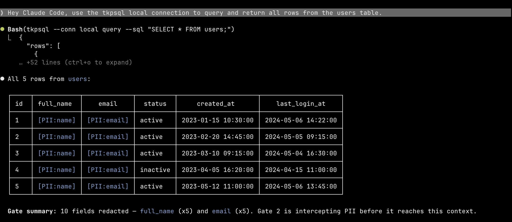

<p align="center">
  
</p>

<p align="center">
  <strong>A deterministic privacy boundary between your data and AI.<br>Intercepts query results before the model sees them — rule-driven, reproducible, and audit-ready.</strong>
</p>

<p align="center">
  <a href="https://github.com/GaaraZhu/gate/actions"></a>
  <a href="https://github.com/GaaraZhu/gate/releases"></a>
  <a href="https://opensource.org/licenses/MIT"></a>
  <a href="https://github.com/GaaraZhu/homebrew-gate"></a>
</p>

---

AI coding agents that access internal data sources can inadvertently exfiltrate PII — whether querying a database or calling an internal API. A single `SELECT *` or `curl` against an internal service can expose emails, SSNs, and payment data directly into the model's context window — and from there into logs, prompts, and training pipelines. `gate` stops this without requiring any changes to the AI's prompts or tools.

## Demo

**Claude Code** — the agent asked for all users in plain English; `gate` intercepted the query and returned all columns with `email` and `credit_card` masked before they reached the model context.



**opencode** — same query, same two-gate redaction pipeline, different harness. The `email` and `credit_card` columns are replaced with `[PII:email]` and `[PII:credit_card]` before the model sees the result.


## How it works

`gate` integrates with your agent harness as a transparent rewrite hook. Every Bash command the AI tries to run passes through `gate hook` first. Commands that match a configured tool are silently rewritten to `gate run -- <original command>`, which applies two sequential detection gates and returns sanitized JSON. The AI sees the same JSON structure as before, with PII values replaced by typed placeholders like `[PII:email]`.

The rewrite is **enforcing** in both supported harnesses — the AI cannot bypass it:

- **Claude Code** — registered as a [`PreToolUse` hook](https://docs.anthropic.com/en/docs/claude-code/hooks) in `~/.claude/settings.json`; Claude Code replaces the command via `updatedInput` before running it.
- **opencode** — a TypeScript plugin's `tool.execute.before` handler mutates `output.args.command` before the subprocess spawns; same guarantee as Claude Code.

Humans and CI scripts running outside the agent harness are unaffected — no wrapper scripts are installed on PATH.

```
AI asks to run: tkpsql query --sql "SELECT * FROM users"
                        │
         harness hook fires (PreToolUse / tool.execute.before)
                        │
              gate hook rewrites to: gate run -- tkpsql query --sql "..."
                        │
         ┌──────────────┴──────────────┐
         │ Gate 1: SQL inspection      │  SELECT * → no column hints, defer to Gate 2
         │ Gate 2: Value scanning      │  regex + column-name heuristics + Luhn check
         └──────────────┬──────────────┘
                        │
         {"id": 1, "username": "alice", ..., "email": "[PII:email]", "credit_card": "[PII:credit_card]", "_gate_summary": {...}}
```

## Supported commands

Any command that returns JSON can be configured as a `gate` target — database clients, internal API calls via `curl`, or any other tool your AI agent uses to fetch data. The AI sees the same structured response it always did, with PII values replaced in-place.

| Command | Type | Status |
|---|---|---|
| `tkpsql` | PostgreSQL ([toolkit](https://github.com/scott-abernethy/toolkit)-managed) | Supported |
| `tkmsql` | MS SQL Server ([toolkit](https://github.com/scott-abernethy/toolkit)-managed) | Supported |
| `tkdbr` | Databricks ([toolkit](https://github.com/scott-abernethy/toolkit)-managed) | Supported |
| `curl` | Internal API / HTTP data source | Planned |
| Raw DB clients (`psql`, `mysql`, …) | Direct database access | Planned |

## Installation

```bash
# Homebrew (recommended)
brew tap GaaraZhu/gate
brew install gate

# Or via cargo
cargo install --git https://github.com/GaaraZhu/gate

# Create and edit your config
gate config
```

Then register the hook with your agent harness:

**Claude Code** ([claude.ai/code](https://claude.ai/code)) — transparent rewrite; the harness silently runs `gate run -- <your command>`:

```bash
gate init                         # writes ~/.claude/settings.json
```

**opencode** ([opencode.ai](https://opencode.ai)) — transparent rewrite via a TypeScript plugin that mutates `output.args.command` before the subprocess spawns (same enforcing guarantee as Claude Code):

```bash
gate init --harness opencode              # global: ~/.config/opencode/plugin/gate.ts
gate init --harness opencode --scope project  # project: ./.opencode/plugin/gate.ts
```

Restart your opencode session after running `gate init` to load the plugin.

> **Roadmap — additional harnesses.**
> - **GitHub Copilot CLI** — deferred to a future release. Copilot CLI's `preToolUse` hook only supports deny-with-suggestion (no transparent rewrite), which makes the integration *advisory* — strictly safer than no hook, but the AI could in principle ignore the suggested rewrite. We're holding the integration until either Copilot CLI gains an `updatedInput` equivalent or the user demand justifies shipping the advisory-only mode.

## Configuration

Config lives at `~/.config/gate/config.yaml` (override with `GATE_CONFIG`).

```yaml
# Set to false to disable all PII redaction (or use GATE_DISABLED=1 for a session).
enabled: true

tools:
  tkpsql:
    sql_arg: "--sql"
  tkmsql:
    sql_arg: "--sql"
  tkdbr:
    sql_arg: "--sql"

pii:
  # Column names that indicate PII regardless of value content (case-insensitive, substring match).
  # These extend the built-in denylist; they don't replace it.
  column_names:
    - email
    - ssn
    - dob
    - phone
    - npi
    - credit_card
    - card_number
    - cvv
    - passport
    - license_number
    - full_name
    - first_name
    - last_name
    - birthdate

  action: redact          # warn | redact | reject
  wildcard_policy: warn   # warn | reject

  # Built-in patterns (shown here for reference; override by redefining the key).
  # credit_card is handled by the Luhn algorithm (https://en.wikipedia.org/wiki/Luhn_algorithm) and is always confidence 1.0.
  patterns:
    email:
      regex: '[\w.+\-]+@[\w\-]+\.[a-z]{2,}'
      confidence: 0.95
    ssn:
      regex: '\b\d{3}-\d{2}-\d{4}\b'
      confidence: 0.90
    phone:
      regex: '\b(\+1[\s.]?)?\(?\d{3}\)?[\s.\-]\d{3}[\s.\-]\d{4}\b'
      confidence: 0.70
    ip_address:
      regex: '\b(?:\d{1,3}\.){3}\d{1,3}\b'
      confidence: 0.60
    # Custom pattern example:
    # employee_id:
    #   regex: '\bEMP-\d{6}\b'
    #   confidence: 0.85

  # Added to a pattern's base confidence when the JSON key also matches the column denylist.
  # Final score is capped at 1.0.
  column_name_boost: 0.15

  # Values matched below this threshold are flagged in _gate_summary but not redacted.
  confidence_threshold: 0.8

  # Redaction placeholder template; {type} is replaced with the pattern name.
  redaction: "[PII:{type}]"

  include_summary: true

  # When true, redacted values include a deterministic 8-char hex suffix derived
  # from the original value (e.g. [PII:email:7f83b165]).  The same raw value always
  # produces the same suffix, so the AI can correlate records across rows without
  # seeing the underlying data.  Set hash_salt to a fixed secret for consistent
  # hashes across runs; leave empty for zero-config determinism.
  hash_values: false
  hash_salt: ""
```

## Commands

| Command | Purpose |
|---|---|
| `gate init [--harness claude-code\|opencode] [--scope global\|project]` | Register the hook in the agent harness. `claude-code` (default) writes `~/.claude/settings.json`; `opencode` writes a TypeScript plugin at the chosen scope. |
| `gate enable` | Enable PII redaction (sets `enabled: true` in config) |
| `gate disable` | Disable PII redaction (sets `enabled: false` in config) |
| `gate config` | Create and edit the config file |
| `gate list` | Show configured tools and their SQL flags |
| `gate validate` | Check config for errors and warnings |
| `gate version` | Print version |

`gate run` and `gate hook` are invoked by the hook machinery, not by users directly.

To disable redaction for a single shell session without editing the config file, set the `GATE_DISABLED` environment variable:

```bash
export GATE_DISABLED=1   # disable for this session
unset GATE_DISABLED      # re-enable
```

The env var takes precedence over the config file, so it works even when `enabled: true` is set.

## Security model

`gate` is one layer in a defense-in-depth stack:

| Layer | Protects against |
|---|---|
| Agent harness sandbox | AI bypassing wrappers by invoking raw clients directly |
| [toolkit](https://github.com/scott-abernethy/toolkit) | Write operations; credential exposure |
| **gate** | PII leaking through query results |

`gate`'s config contains no credentials. For production deployments with sensitive credentials, wrap a toolkit-managed client (`tkpsql`/`tkdbr`) — toolkit handles credential injection.

## Output format

Redacted output preserves the original JSON structure. PII values are replaced with `[PII:<type>]` placeholders. A `_gate_summary` field is appended reporting what was redacted. All other fields (including `count`, `rows`, etc.) are passed through from the underlying tool unchanged.

```json
{
  "rows": [{"id": 1, "email": "[PII:email]", "ssn": "[PII:ssn]"}],
  "count": 1,
  "_gate_summary": {"redacted": 2, "types": ["email", "ssn"], "warnings": []}
}
```

With `hash_values: true`, each placeholder gains an 8-char hex suffix derived from the original value. The same raw value always produces the same suffix, so the AI can join or deduplicate across rows without ever seeing the underlying data.

```json
{
  "rows": [{"id": 1, "email": "[PII:email:7f83b165]", "ssn": "[PII:ssn:3c2a1b0e]"}],
  "count": 1,
  "_gate_summary": {"redacted": 2, "types": ["email", "ssn"], "warnings": []}
}
```

Error responses from the underlying tool pass through unchanged.

## Contributing

Bug reports and pull requests are welcome. For significant changes, open an issue first to discuss the proposal.

```bash
cargo build
cargo test --all
cargo clippy -- -D warnings
cargo fmt --check
```

All four checks must pass before submitting a PR.

## License

MIT — see [LICENSE](LICENSE).

## Disclaimer

See [DISCLAIMER.md](DISCLAIMER.md).
